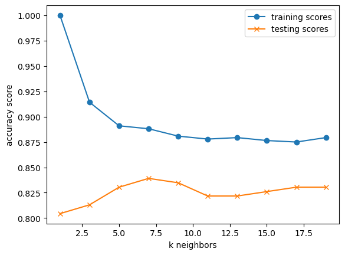

# heart-failure
This is project 2 for Rutgers AI bootcamp
Dr. House wants to know, can we predict heart disease with a model?

## Project Summary
The goal of this project is to identify the best-performing AI model that predicts  whether a patient has heart disease.

## Data Preprocessing steps
- One-Hot encoder to encode the categorical columns
- StandardScaler to standardize the magnitude of  numerical columns

## Logistic Regression Model
- Creates a decision boundary line that separates two classes: “Heart Disease” and “No Heart Disease"
- Applies sigmoid function to calculate the probability of having heart disease.  
- Prediction: 
  - If above 0.5 then “heart disease”, 
  - if lower or equal to 0.5 then “no heart disease”

## Support Vector Machine (SVM)
- Creates a hyperplane or decision boundary that separates two classes: “Heart Disease” and “No Heart Disease.”
- Uses kernel functions to transform data into a higher-dimensional space, making it easier to separate non-linear data.
- Prediction:
  - If a data point lies on one side of the hyperplane, it is classified as “Heart Disease.”
  - If it lies on the other side, it is classified as “No Heart Disease.”

## K-nearest neighbors (KNN)
- For each test data point, the model identifies the closest data points in the training set and assigns it to the category that appears most frequently among them.

## Decision Trees and Decision Tree Ensembles 
The second file "Failing_hearts.ipynb" performs the same preprocessing of the dataset in order to test the performance of decision tree and decision tree ensemble classifiers. 

Parameters of each classifier such as the number of estimators, which determines the total trees the ensemble uses, are iterated through in for loops and their accuracies recorded and compared. 
As ensembles can be complex and take long to fit/test, the python library tqdm is used to generate a timing for the iteration which the user can take into account when deciding on the range and step of the for loop used.
The scores per each parameter are then plotted using matplotlib to generate a graph such as the one below:

Graphs are generated for each change in parameter and each ensemble tested, an example for the DecisionTreeClassifier is shown below:

DecisionTreeClassifier: a standard decision tree 
  1. parameter changed: Minimum Leaf Samples

 2. parameter changed: Minimum Sample Split

For additional graphs and combinations check "Failing_hearts.ipynb". 
The ensembles and trees tested for fit are:

DecisionTreeClassifier: a standard decision tree

GradientBoostingClassifier: the ensemble is formed by regression trees which are fit on the negative gradient of the loss function. 

AdaBoostClassifier: first an original classifier is fit on the data and then copies are fit on the data, the weights of failed classifications are adjusted. Idea is that classifications which are often wrong are focused on more. 

RandomForestClassifier: Randomized decision tree classifiers are fit on sub-samples of the data except the trees use 'best split strategy' in order to prune badly performing trees. Averaging of the trees are done to generate a prediction.

ExtraTreesClassifier: Similarly to RandomForestClassifier, randomized extra trees are fit, except on the whole data and then tested on sub-samples of the data during fitting. Averaging of the trees are then done to generate a prediction. 

HistGradientBoostingClassifier: A faster version of GradientBoostingClassifier.

The parameters tested when used as a parameter for the ensemble/classifier are:

number of estimators: the number of decision trees used in the ensemble

min_sample_leaf: the minimum number for a node to be a leaf

min_sample_split: the minimum number required to split an internal node

learning_rate: the rate at which the classifiers update

max_leaf_nodes: limits the number of leaf nodes

max_bins: maximum number of bins to use to bin each feature array 

min_impurity_decrease: causes a split in the node if it causes a decrease of impurity >= to this value

## Conclusion

In our fitting we found the best performing classifier to be the RandomForestClassifier due to both its good generalization and best testing accuracy score, refer to the graph below for a sense of the high testing accuracy while changing the minimum sample split and keeping the number of estimators at 40. The other graphs for the RandomForestClassifier generated by chaning other parameters are used to create a range starting point for a final optimization of combined changes in parameters iterated through via multiple nested for loops. 

The testing and training scores and their absolute differences are stored from each combination of parameters and used to form a dataframe which is then saved as a csv file. Via visual inspection, the maximum testing score is determined which also follows the criteria of having a difference less than 0.05 (i.e. good generalization).
The best result has a training and testing accuracy of ~0.90 with a negligable differnece 0.001 the parameters are:

min_sample_split: 17
number of estimators: 58
min_sample_leaf: 0.01
min_impurity_decrease: 0

### Citations
Heart disease dataset from kaggle https://www.kaggle.com/datasets/fedesoriano/heart-failure-prediction
scikit-learn.org
